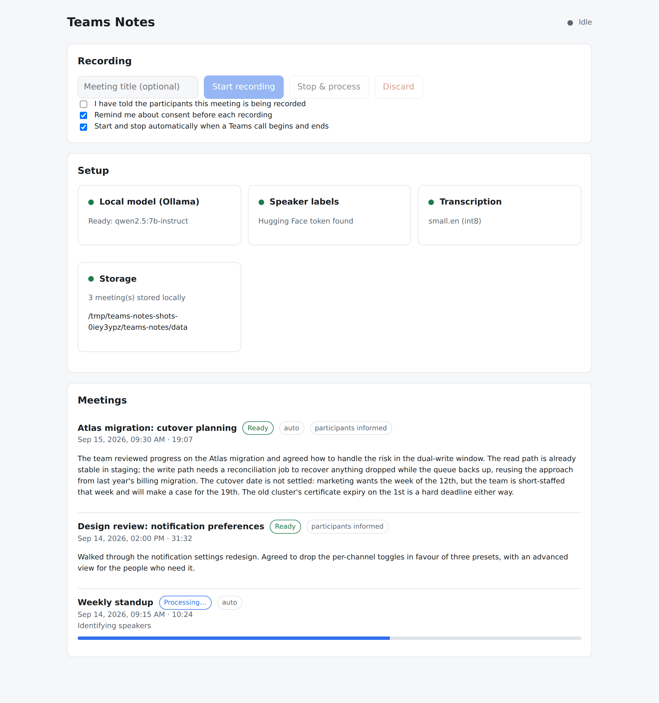
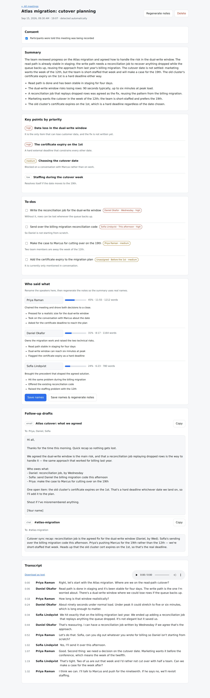

# Teams Notes

A free, fully local meeting assistant for Microsoft Teams on Windows.

It sits in the system tray, records both sides of a Teams call, and when the
call ends it produces a timestamped transcript, a summary, bullet points, a
to-do list, a priority ranking, a per-speaker breakdown, and draft follow-up
messages — all in a dashboard in your browser.

**Nothing leaves your machine.** Every model runs locally. There are no API
keys, no subscriptions, no cloud transcription, and no telemetry.

---

## What it looks like

The meeting list, with the setup check, the recording controls and the consent
toggles:

<picture>
  <source media="(prefers-color-scheme: dark)" srcset="docs/dashboard-meetings-dark.png">
  
</picture>

A processed meeting: summary, priority ranking, to-dos, the rename-speakers
step with talk-time shares, draft follow-ups, and the timestamped transcript:

<picture>
  <source media="(prefers-color-scheme: dark)" srcset="docs/dashboard-meeting-dark.png">
  
</picture>

The dashboard follows your system's light or dark setting. These are real
screenshots of the running app, captured by `tools/make_screenshots.py` against
invented demo content — no real meeting, and nobody in them exists.

---

## Contents

- [What it looks like](#what-it-looks-like)
- [What it does](#what-it-does)
- [Requirements](#requirements)
- [Setup](#setup)
- [Everyday use](#everyday-use)
- [The command line](#the-command-line)
- [Consent and recording responsibly](#consent-and-recording-responsibly)
- [How it works](#how-it-works)
- [Configuration](#configuration)
- [Security](#security)
- [Troubleshooting](#troubleshooting)
- [Development](#development)

---

## What it does

| | |
|---|---|
| **Records both sides** | WASAPI loopback captures the other participants; a second stream captures your microphone. The two are mixed into one WAV. |
| **Transcribes** | `faster-whisper` with `small.en` and int8 quantisation — comfortably real time on a CPU. |
| **Labels speakers** | `pyannote.audio` produces `Speaker 1 / Speaker 2 / …`, which you rename once in the dashboard. |
| **Writes the notes** | A local LLM via Ollama produces the summary, bullets, to-dos, priority ranking, per-speaker breakdown and draft follow-ups. |
| **Stores everything** | One SQLite file under `data/`. No server, no account. |
| **Runs hands-free** | It notices when a Teams call starts and ends, so you can join a meeting, do nothing, and find the notes waiting. |

---

## Requirements

- **Windows 10 or 11.** WASAPI loopback is a Windows API; the capture side
  cannot work anywhere else.
- **Python 3.11.** Not 3.12 or 3.13 — several of the ML libraries below still
  lag behind on those.
- **About 8 GB of free RAM** while processing, and ~6 GB of disk for the models.
- **No GPU needed.** Everything is chosen to run on CPU.

---

## Setup

Five steps. Steps 3 and 4 are one-time downloads.

### 1. Get the code and create a virtual environment

```powershell
git clone <this-repo> teams-notes
cd teams-notes
py -3.11 -m venv .venv
.venv\Scripts\activate
pip install --upgrade pip
pip install -r requirements.txt
```

The install pulls in PyTorch and takes a few minutes. On Windows the default
PyPI wheel is already CPU-only, which is what we want. If pip ever tries to
fetch a CUDA build, force the CPU index:

```powershell
pip install torch torchaudio --index-url https://download.pytorch.org/whl/cpu
```

### 2. Install ffmpeg

`faster-whisper` uses ffmpeg to decode audio.

```powershell
winget install --id Gyan.FFmpeg -e
```

Then **close and reopen your terminal** so the new `PATH` takes effect, and
check it worked:

```powershell
ffmpeg -version
```

(If you would rather not use winget: download a build from
<https://www.gyan.dev/ffmpeg/builds/>, unzip it, and add its `bin` folder to
your `PATH`.)

### 3. Install Ollama and pull a model

Ollama is free and runs the language model locally.

1. Download and install it from <https://ollama.com/download>.
2. Pull the model:

```powershell
ollama pull qwen2.5:7b-instruct
```

That is about 4.7 GB and uses roughly 5 GB of RAM while running. If your machine
feels tight, use the smaller model instead:

```powershell
ollama pull llama3.2:3b
```

…and set `OLLAMA_MODEL=llama3.2:3b` in your `.env` (next step). It is faster and
lighter, but the summaries are noticeably less sharp.

Ollama normally starts with Windows and stays running. Check it:

```powershell
ollama list
```

### 4. Get a free Hugging Face token (for speaker labels)

This is only needed to tell speakers apart. Everything else works without it.

1. Create a free account: <https://huggingface.co/join>
2. Accept the model terms — **you must do this while signed in**, on both pages:
   - <https://huggingface.co/pyannote/speaker-diarization-3.1>
   - <https://huggingface.co/pyannote/segmentation-3.0>
3. Create a **read** token: <https://huggingface.co/settings/tokens>

There is no cost and no card required.

### 5. Create your `.env`

```powershell
copy .env.example .env
notepad .env
```

Paste your token in:

```
HF_TOKEN=hf_your_token_here
```

Everything else has a sensible default. `.env` is gitignored — never commit it.

### Check the setup

```powershell
python main.py doctor
```

This tells you, line by line, what is ready and what is not, with the exact
command to fix anything that is missing.

---

## Everyday use

```powershell
.venv\Scripts\activate
python main.py tray
```

A tray icon appears. The first time, it shows the recording notice and asks you
to acknowledge it once.

From the tray menu you can:

- **Start / stop recording** — the icon turns **red** while recording, and the
  tooltip says so. The app never hides that it is running.
- **Open dashboard** — opens your browser at the meeting list.
- **Detect Teams calls automatically** — on by default. Join a call, do nothing,
  and the notes appear afterwards.
- **Quit** — stops cleanly, saving any recording in progress.

After a meeting, the dashboard shows the transcript, summary, to-dos, priorities,
per-speaker breakdown and drafts. Rename the speakers there, then hit
**Save names & regenerate notes** so the summary uses real names.

---

## The command line

Useful when you want to script something, or test without joining a real call.

```powershell
python main.py doctor              # check the setup
python main.py devices             # list audio devices and show which will be used
python main.py tray                # normal background use
python main.py dashboard           # just the dashboard, no tray
python main.py record              # record until you press Enter, then process
python main.py record --seconds 60 # record for a fixed time
python main.py import call.wav     # process an existing WAV file
python main.py process 3           # re-run processing for meeting 3
python main.py meetings            # list meetings
python main.py consent --reset     # show the recording notice again
```

`import` is the easiest way to try phases 2–5 without recording anything: point
it at any WAV with speech in it.

---

## Consent and recording responsibly

This tool captures what your colleagues say, so it is built to keep that
visible rather than quiet:

- **A notice on first run**, which you acknowledge once before anything records.
  Until you do, recording is refused — from the tray, the dashboard and the CLI
  alike.
- **A red tray icon and a "RECORDING" tooltip** whenever audio is being
  captured. The app is never disguised.
- **A per-meeting flag** recording whether you confirmed that participants were
  told. It shows in the meeting list and can be set before or after the call.
- **A consent reminder toggle** in the dashboard.

Whether you need to inform participants, and whether recording is allowed at
all, depends on where you are and on your employer's policy. That part is yours
to get right; the app's job is to make it easy to remember and easy to record
what you did.

---

## How it works

The guiding constraint is that the target machine has no GPU, so the pipeline
splits sharply into "during" and "after":

```
DURING THE MEETING (cheap, real time)
  ┌─ WASAPI loopback ──► loopback.wav      the other participants
  └─ microphone ───────► microphone.wav    you
                              │
AFTER THE MEETING (heavy, one to two minutes)
                              ▼
                        mix ──► mixed.wav  (16 kHz mono)
                              │
              faster-whisper  ▼            transcript + word timings
                              │
                 pyannote     ▼            speaker turns
                              │
                   merge      ▼            words attributed, turns merged
                              │
            Ollama (local)    ▼            summary, bullets, to-dos,
                              │            priorities, speakers, drafts
                          SQLite
                              │
                         dashboard
```

**Why the microphone is recorded separately.** WASAPI loopback records what
Windows *plays to the speakers*, which is everyone else on the call. It does not
capture your own voice, because your voice is sent out rather than played back
to you. So two streams are recorded and mixed.

**Why they are mixed afterwards, not live.** The two devices run on independent
clocks. Summing them in real time makes the result sensitive to buffer jitter,
and one dropped callback shifts everything after it. Instead each stream is
written to its own track and aligned once at the end, using the instant each
stream actually delivered its first frame. Keeping the raw tracks also means a
failed mix can be retried, and a missing microphone costs you your own voice
rather than the whole recording.

**Why the tracks are level-matched.** Meeting audio is usually much louder than
a laptop microphone. Summing them raw buries your own voice below Whisper's
noise floor, so each track is brought to a common RMS level first — within a
capped gain, so near-silence is not amplified into a roar.

**How diarization is merged with the transcript.** Whisper and pyannote
disagree about boundaries, so each *word* is attributed to the speaker turn it
overlaps most, single-word flips between two runs of the same speaker are
smoothed away as boundary artefacts, and adjacent same-speaker segments are
merged back into readable turns. All of this is pure functions over plain data,
in `app/diarize/merge.py`, and it is the most heavily tested part of the app.

**How long meetings are handled.** An hour of speech overflows the model's
context window. Rather than truncating, long transcripts are chunked at speaker
boundaries (with overlap), each chunk is summarised into structured notes, the
notes are merged, and the final prompts run over those.

### Layout

```
teams-notes/
  main.py                  the command line
  config.py                configuration, loaded from .env
  app/
    capture/               loopback + microphone, mixing, WAV I/O
    transcribe/            faster-whisper wrapper, transcript types
    diarize/               pyannote wrapper + the merge logic
    intelligence/          Ollama client, prompts, chunking, schemas
    db/                    SQLite schema, connections, queries
    pipeline/              the processing pass, job queue, service façade
    web/                   FastAPI app, security, dashboard frontend
    tray/                  the pystray tray app
    autodetect/            Teams call detection
  tests/                   263 tests, no heavy dependencies needed
  data/                    database, audio, logs, models (gitignored)
```

---

## Configuration

Everything lives in `.env`. See `.env.example` for the full annotated list. The
ones you are most likely to touch:

| Setting | Default | What it does |
|---|---|---|
| `HF_TOKEN` | *(empty)* | Hugging Face read token. Without it, speakers are not labelled. |
| `WHISPER_MODEL` | `small.en` | `medium.en` is more accurate and noticeably slower. |
| `OLLAMA_MODEL` | `qwen2.5:7b-instruct` | `llama3.2:3b` is lighter and faster. |
| `DIARIZATION_ENABLED` | `true` | Turn off to skip speaker labelling entirely. |
| `WEB_PORT` | `8765` | Change if something else already uses that port. |
| `AUTO_DETECT_ENABLED` | `true` | Hands-free start/stop. |
| `AUTO_STOP_AFTER_SECONDS` | `45` | How long Teams audio must be quiet before a call counts as over. |
| `MIC_DEVICE_NAME` | *(empty)* | Substring match to pick a specific microphone. |
| `AUDIO_RETENTION_DAYS` | `0` (keep) | Delete audio older than N days, keeping the notes. |

---

## Security

The app holds recordings of private conversations, so a few things are stricter
than a typical local tool:

- **The dashboard refuses to listen off-machine.** Setting `WEB_HOST` to
  anything but loopback is a configuration error, not a warning.
- **"Only on localhost" is not treated as a boundary.** Every other program on
  the machine can reach `127.0.0.1`, so the dashboard requires a random
  256-bit token, stored in `data/runtime/dashboard-token` with owner-only
  permissions. The tray and the CLI hand you an authorised link; that link
  swaps the token for an `HttpOnly`, `SameSite=Strict` cookie and redirects, so
  the token does not linger in your address bar. HTTP access logging is off so
  it does not land in a log file either.
- **DNS rebinding is blocked.** A page you visit can point a hostname it
  controls at `127.0.0.1` and read the responses. Only loopback `Host` values
  are answered; anything else gets a 421.
- **Writes need a custom header**, which a cross-site form post cannot set
  without a CORS preflight the server refuses.
- **Transcripts and model output are never treated as markup.** The frontend
  builds DOM nodes and sets `textContent`; there is no `innerHTML` anywhere, and
  a strict Content-Security-Policy with no inline script is the backstop. A test
  enforces this.
- **Prompt injection is contained.** A participant can say "ignore your
  instructions" on a call. Transcript text is always fenced in a labelled block
  that it cannot close, and every system prompt states the block is data and
  never instructions. Combined with the rendering rule above, the worst case is
  a strange summary, not code execution.
- **Stored paths are sandboxed.** Anything that turns a database row into a file
  the server will open is resolved and checked against the data directory first,
  so a tampered row cannot make the dashboard serve an arbitrary file.
- **Credentials are kept out of logs.** The Hugging Face token is wrapped in a
  type that will not print itself, and a logging filter scrubs token-shaped
  strings from third-party tracebacks.
- **All SQL is parameterised**, and the one place that builds a column list does
  so from a fixed allowlist, never from caller data.

---

## Troubleshooting

**`python main.py doctor` is the first thing to run.** It names the fix for
anything it finds. Beyond that:

| Symptom | Cause and fix |
|---|---|
| "No WASAPI loopback device was found" | No playback device is enabled. Check Windows Sound settings, then restart the app. |
| Only one side of the call is audible | Run `python main.py devices`. If the wrong device was picked, set `MIC_DEVICE_NAME` or `LOOPBACK_DEVICE_NAME` in `.env` to part of the right device's name. |
| "Could not reach Ollama" | Ollama is not running. Start it, or run `ollama serve`. |
| "Ollama is running but does not have …" | `ollama pull qwen2.5:7b-instruct` |
| "the model is gated and this account has not accepted its terms" | Sign in to Hugging Face and accept the terms on **both** pyannote pages linked in step 4. |
| "Hugging Face rejected the token (401)" | The token is wrong or expired. Make a new **read** token and update `.env`. |
| Speakers are not labelled | Either `HF_TOKEN` is missing or `DIARIZATION_ENABLED=false`. The meeting page lists the reason under its warnings. |
| Processing is very slow | Expect roughly one to two minutes for a 30-minute meeting. If it is much worse, switch to `llama3.2:3b`, or `WHISPER_MODEL=small.en` if you had raised it. |
| Out of memory during processing | Use `llama3.2:3b`, and close other heavy apps. Processing runs one meeting at a time on purpose. |
| "The dashboard server stopped immediately" | Port 8765 is taken. Set `WEB_PORT` in `.env`. |
| "Not authorised" in the browser | Open the dashboard from the tray menu, or run `python main.py dashboard` for a fresh authorised link. |
| Auto-detect never fires | It needs `pycaw` (`pip install pycaw`) and Windows. Check the toggle in the dashboard, and give it `AUTO_START_AFTER_SECONDS` before expecting it. |
| A meeting is stuck as "Processing" | It will be marked failed on the next start. `data/logs/teams-notes.log` has the reason. |

Everything is under `data/`: the database, the audio, and rotating logs. Deleting
that folder resets the app completely.

---

## Development

```bash
python -m venv .venv
.venv/bin/pip install -r requirements-dev.txt
.venv/bin/python -m pytest
```

The test suite runs **on any platform in a few seconds** and needs none of the
heavy dependencies. The four things that need Windows, a 5 GB model or a running
Ollama — capture, Whisper, pyannote and the LLM — are faked at their boundaries.
Everything between them is the real code: mixing, the merge logic, chunking,
schema coercion, the database, the job queue, the service, the detector, and the
HTTP API including its authentication, CSRF and rebinding defences.

`tests/test_end_to_end.py` walks all six phases in one test.

To check coverage:

```bash
.venv/bin/python -m pytest --cov=app --cov=config --cov-report=term-missing
```

The README screenshots are generated from the running app rather than drawn by
hand. To regenerate them after a UI change:

```bash
pip install playwright && playwright install chromium
python tools/make_screenshots.py
```

---

## Licence and cost

Every dependency is free and open source, or a free tier that needs no card.
There are no paid services anywhere in this app, and nothing you record is sent
off your machine.
